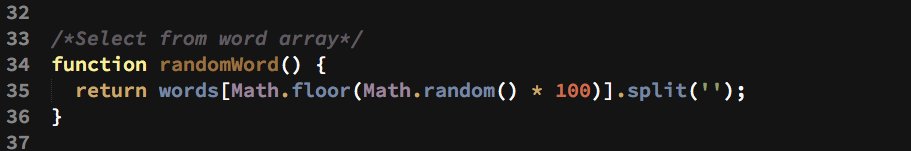

#
 ¡SALVANOS!

###
(SAVE US)

**A Classic's Spinoff**

Salvanos is a spin off the classic Hangman game where the participant must guess a Spanish word by guessing a letter at a time.

Salvanos, however, departs from Hangman in two aspects:  
   
>1. the human player has to successfully decipher each word against a simulated bomb countdown rather than deciphering before reaching a maximum number of guessing errors   
2. This game is geared towards those learning Spanish and reinforcing their recall of vocabulary  

The game is oriented as an educational application that is geared for the person who wants to challenge themselves to quickly recognize a foreign word and simulate a military intelligence setting where real time interpretation is key and avoiding any type of catastrophic event.  For more insight, I served in the U.S. Air Force as a Russian Cryptologic Linguist and thought that this type of vocabulary game could help a foreign language student in any context, but be particularly fun for the military foreign language student.

##TRELLO
My wireframing notes can be observed on my Trello project page at:

 [Salvanos Project](https://trello.com/b/xaWMPggW/salvanos)

##Technologies
The following scripting and programming languages were used in the creation of this game:  
>1. HTML5
>2. CSS3
>3. Javascript
>4. jQuery

###Random Word Generation 

To randomly select a word within an array of 100 words, I used a simple math.random function and multipled the random word by 100 to select a word, as seen below in the image clip:  

**Word List**  
>The words are stored in an array and each word meaning varies in parts of speech, related subject, and form.  All verbs are in their infinitive form.  This list of words will increase over time as I select words in their proper Castillan version and add them accordingly.  Dialectic and colloquial words have not been used as of now; however, this type of feature would allow for vocabulary growth.  Also, all words are singular and do not have neither corresponding prepositions or articles before them.

**Game**  
The game can be played by anyone on a desktop or mobile device and accessed through any and all browsers.  The design was simplified as much as possible with HTML and CSS so that the view is standardized across all platforms.  On initial onload, the game should appear as it is in the screenshot:  

  

**Game Sequence**   
Upon clicking the Start button, a count down of 20 seconds begins on the right of the screen.  If a player is successful in deciphering the word, an alert message will pop congratulating the player and the countdown timer will stop.  If the countdown reaches to 0 and the player has not succesfully guessed all letters, an alert message will pop up showing the word and simulating a "BOOM" effect.

###Game Play
 [Click to Play](http://http://cjzamora83.github.io/salvanos//)

###Design & Credits
The following individuals assisted me immensely with the development of this game and contributed code and/or revisions to my initial code:
>[Ezra Raez](https://github.com/EARnagram)        
>[Jim Clark](https://github.com/jim-clark)  
>[Phil Hughes](https://github.com/h4w5)  

The background image is a snapshot of the main actor on set of the movie _The Imitation Game_, a biopic on the British cryptanalyst Alan Turing.  The source of the image can be found at:  

>http://www.infiltrados.org/wp-content/uploads/2015/02/The-Imitation-Game-Slider.jpg

I claim no rights or ownership to the image and have used it solely for educational purposes within the context of this game.  All rights belong to The Weinstein Company, which distributed the film.

###Future Updates  

As of now, there are two revisions that I will work on:  
>1. Increasing the word list count from 100 to 500, gradually
>2. Apply some animation effects when a Lose condition has been determined
